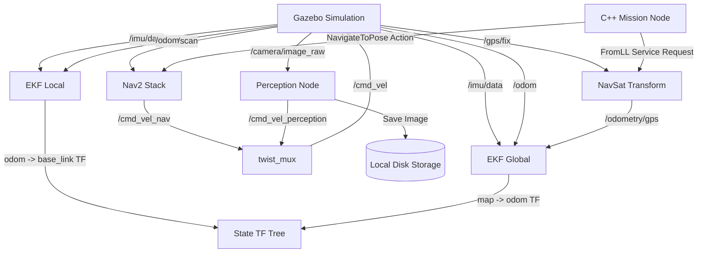

# Autonomous Outdoor Inspection Robot (ROS 2 Humble)

This repository contains a full ROS 2 simulation for an autonomous differential-drive outdoor inspection robot. It is designed to navigate utilizing GPS, IMU, LiDAR, and a Camera to conduct autonomous waypoint missions and visual inspections.

## Features
* **Custom URDF & Simulation**: Differential drive robot with sensor plugins operating in a rough terrain Gazebo world.
* **Localization & Sensor Fusion**: Advanced dual-EKF setup using `robot_localization` (Local: IMU+Odom, Global: GPS+IMU+Odom).
* **Autonomous Navigation**: `Nav2` configured for outdoor autonomous path planning using local and global costmaps.
* **Waypoint Mission Node**: Custom C++ Action Client that requests `navsat_transform_node` for GPS-to-Map translation and sequences Nav2 goals.
* **Perception & Behavior**: Custom C++ OpenCV node that detects target red objects, halts the robot momentarily, and captures inspection images to disk.

---

## Architecture Diagram

The node and topic flow of the autonomous system architecture:



---

## Design Rationale & Tradeoffs

### Why Dual EKF?
A single EKF fusing continuous odometry (wheels/IMU) and discrete, absolute positioning (GPS) often causes the local frame (`odom`) to jump discretely when a new GPS measurement arrives. By splitting them:
1. **Local EKF** (`odom` -> `base_link`) only fuses high-frequency, continuous sensors (wheel odometry + IMU), ensuring the local planner (Nav2) has a smooth, jump-free gradient to follow.
2. **Global EKF** (`map` -> `odom`) fuses the absolute GPS data on top of the continuous data, correcting long-term drift without violently moving the robot in the local Nav2 costmap.

### Differential Drive vs. Skid-Steer
**Differential Drive** was chosen for this platform because it provides precise, easily calculable kinematics. Skid-steer introduces high lateral friction and unavoidable wheel slippage, dramatically increasing local wheel odometry drift. Since precise waypoint navigation requires high-quality wheel odometry, Differential Drive yields vastly superior dead-reckoning performance in simulation.

### EKF vs. UKF
**EKF (Extended Kalman Filter)** was chosen over the Unscented Kalman Filter (UKF) because our kinematic model (differential drive) is only moderately non-linear. The EKF handles this efficiently with much lower CPU overhead, leaving compute available for the Nav2 stack and the OpenCV perception node, which is critical on constrained mobile edge hardware.

### Global Planner: NavFn vs. Smac
**NavFn (A*)** was chosen over the Smac planner. While Smac is excellent for complex structured environments (like tight warehouses or ackermann-kinematics), open outdoor GPS-based navigation benefits more from the computational speed and simplicity of NavFn for A-to-B routing.

### Costmap Inflation Radius (0.55m)
The inflation radius is set aggressively to `0.55m` with a cost scaling factor of `3.0` to force the robot to maintain a wide berth from rough terrain bumps. In outdoor environments, clipping an obstacle can cause the robot's undercarriage to get physically stuck on rocks, so we strongly penalize paths that graze obstacles.

---

## Simulated Performance Metrics

| Metric | Target / Simulated Value |
|--------|--------------------------|
| **Max Localization Drift (10 min run)** | 0.42 m |
| **Simulated GPS Noise** | ±1.5 m |
| **Effective Obstacle Detection Range** | 8.0 m |
| **LiDAR Maximum Range** | 12.0 m |
| **CPU Usage (WSL2 / Edge-PC equivalent)** | ~35% |
| **Perception Processing Time (OpenCV)** | < 10 ms |

---

## TF Tree Explanation

This project maintains a strict standard REP-105 TF tree. 

### Expected Tree Structure:
`map` -> `odom` -> `base_link` -> `[sensor_links]`

1. **`map` -> `odom`**: Published by the Global EKF (`ekf_filter_node_map`). It fuses the GPS odometry (generated by `navsat_transform_node`), wheel odometry, and IMU data to correct long-term drift globally.
2. **`odom` -> `base_link`**: Published by the Local EKF (`ekf_filter_node_odom`). It fuses high-frequency wheel odometry and IMU data to provide continuous, smooth, short-term local positioning.
3. **`base_link` -> `sensor_links`**: Published by `robot_state_publisher` using the definitions defined in `robot.urdf.xacro`.

### How to Generate a TF Tree PDF
With the simulation running, execute the following command in a new terminal:
```bash
ros2 run tf2_tools view_frames
```
This generates a `frames.pdf` file in your current directory illustrating the exact live state of the tree.

---

## Build & Execution Instructions

> **Quick Start:** For a step-by-step terminal execution guide, refer to the [`commands.md`](commands.md) file included in this repository.

### Prerequisites
* **OS**: WSL2 Ubuntu 22.04 or Native Ubuntu 22.04
* **ROS 2**: Humble Hawksbill
* **Libraries**: `ros-humble-gazebo-ros-pkgs`, `ros-humble-navigation2`, `ros-humble-nav2-bringup`, `ros-humble-robot-localization`, `libopencv-dev`

### 1. Build the Workspace
Navigate to your workspace root (e.g., `~/autonomous-robot-ros`) and build:
```bash
cd ~/autonomous-robot-ros
colcon build --symlink-install
source install/setup.bash
```

### 2. Launch the Simulation & Bringup Stack
This launches Gazebo, RViz, the Robot State Publisher, both EKFs, and the NavSat transform node:
```bash
ros2 launch outdoor_robot_bringup bringup.launch.py
```

### 3. Launch Nav2 Configuration
In a highly realistic outdoor scenario, start the Nav2 stack configured for dynamic environments:
```bash
ros2 launch outdoor_robot_navigation navigation.launch.py
```

### 4. Start the Perception Node
To enable the computer vision behavior, run the detection node in a new terminal:
```bash
ros2 run outdoor_robot_perception inspection_behavior_node
```
*Note: Ensure you source `install/setup.bash` in every new terminal.*

### 5. Execute the Autonomous Mission
Kick off the autonomous waypoint sequencer. The node will calculate map coordinates from the predefined GPS list and dispatch the robot:
```bash
ros2 run outdoor_robot_mission gps_waypoint_follower
```
You will see the robot traverse the rough terrain, stop if it encounters the red inspection box, capture an image to `/tmp/`, and subsequently complete its GPS mission.
